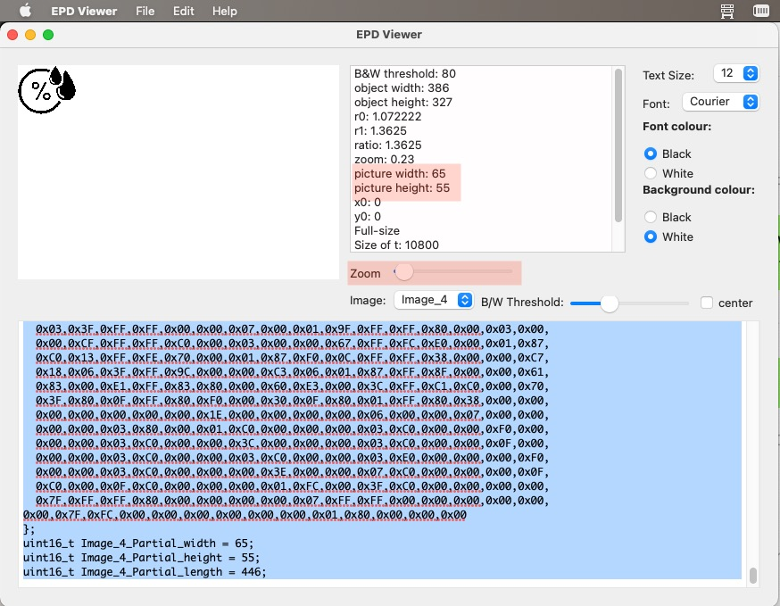

# SE0352NQ01 Library

A library for the SE0352NQ01 e-paper display, driven by a Wisblock RAK4631 (nRF52840 + SX1262). It uses Adafruit GFX fonts for Latin characters, and a vaguely compatible format for Chinese, a subset of 2,500 characters anyway, based on [micropython-font-to-py](https://github.com/peterhinch/micropython-font-to-py). After running

```sh
python3 font_to_py.py -x -k cjk /path/to/font.otf 16 cjk16b.py
```

I cleaned up `cjk16b.py` a little, and added code that produces the `CJK16pt.h` header file. This file can then be included into the Arduino project. The [cjk](assets/cjk) subset file is included, so you can edit it and add/remove chars.

```c
#include <SE0352NQ01.h>
// Include fonts from https://github.com/adafruit/Adafruit-GFX-Library/tree/master/Fonts
#include "FreeSansBold12pt7b.h"
#include "FreeSerifBoldItalic24pt7b.h"
#include "CJK14pt.h"
#include "CJK16ptB.h"
```

## API

```c
    void sleep(void);
    void refresh(void);
    void send(unsigned char*);
    void send_DU(unsigned char*);
    void fill(unsigned char);
    void drawString(char *, uint16_t, uint16_t, GFXfont, uint8_t, unsigned char*);
    void drawUnicode(
      uint16_t*, uint8_t, uint16_t, uint16_t, unsigned char*,
      unsigned char*, uint16_t, uint8_t, uint8_t, unsigned char*
    );
    void drawBitmap(
      uint8_t, uint8_t, uint16_t, uint16_t, int8_t, int8_t,
      uint16_t, unsigned char *, unsigned char *, uint8_t
    );
```

The most important commands are, `drawString`, `drawUnicode`, and `drawBitmap`. The first is for ASCII text, the second for Chinese (or other UTF16 codepoints for which you have produced a font), and the third one is for partial images: it is the same code for both images and individual characters, which are both horizontally-encoded bitmaps. I wrote separately a desktop application that creates full-size images, in the RAM buffer format the EPD expects, from pictures you pass it, and partial images encoded as horizontally-encoded bitmaps. These images are resizable with the `Zoom` slider, and the black-and-white threshold adjustable with the `B/W Threshold` slider.

The `send` and `send_GU` commands send full-size images to the EPD.




This application, `EPD Viewer`, was made with Xojo, which is a paid development platform. I will release the code, but it'd require Xojo to compile it. I've added in the mean time a binary for Mac OS X, which is what I use. When I can test Linux and Windows version, I will release them too.

## Rotation

There are 4 levels of rotation: 0 & 2 (Landscape), and 1 & 3 (Portrait). Rotation is passed to `drawString`, `drawUnicode`, and `drawBitmap` functions every time, so you can draw text in different rotations within the same screen. `send` and `send_GU` don't have yet rotation enabled.

## Drawing

I have added a few drawing primitives:

* `void setPixel(uint16_t x, uint16_t y, uint8_t rotation, uint8_t *buffer);`
* `void drawHLine(uint16_t x0, uint16_t y0, uint16_t x1, uint8_t *buffer, uint8_t rotation);`
* `void drawVLine(uint16_t x0, uint16_t y0, uint16_t y1, uint8_t *buffer, uint8_t rotation);`
* `void drawLine(uint16_t x0, uint16_t y0, uint16_t x1, uint16_t y1, uint8_t *buffer, uint8_t rotation);`
* `void drawCircle(int xc, int yc, int r, uint8_t *buffer, uint8_t rotation);`
* `void fillCircle(int xc, int yc, int r, uint8_t *buffer, uint8_t rotation);`
* `void drawRect(uint16_t x0, uint16_t y0, uint16_t x1, uint16_t y1, uint8_t *buffer, uint8_t rotation);`
* `void fillRect(uint16_t x0, uint16_t y0, uint16_t x1, uint16_t y1, uint8_t *buffer, uint8_t rotation);`


## Demo


